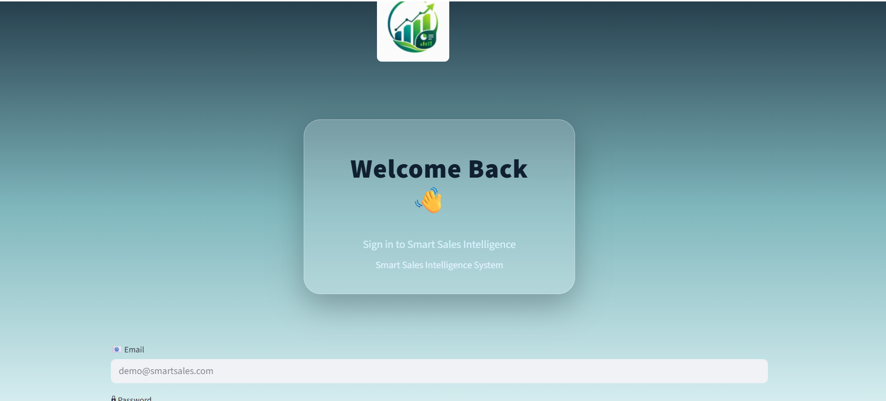
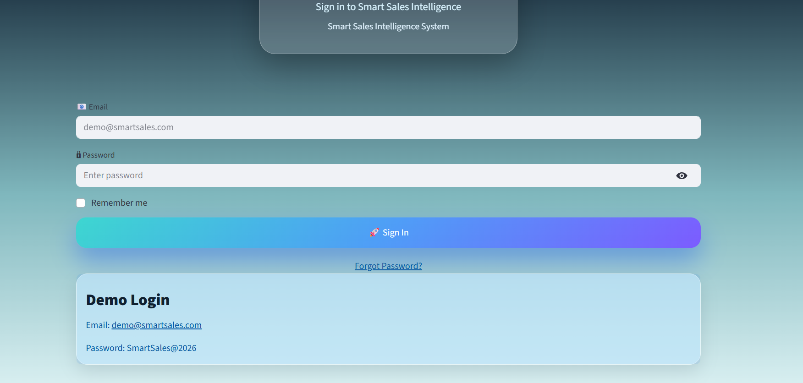
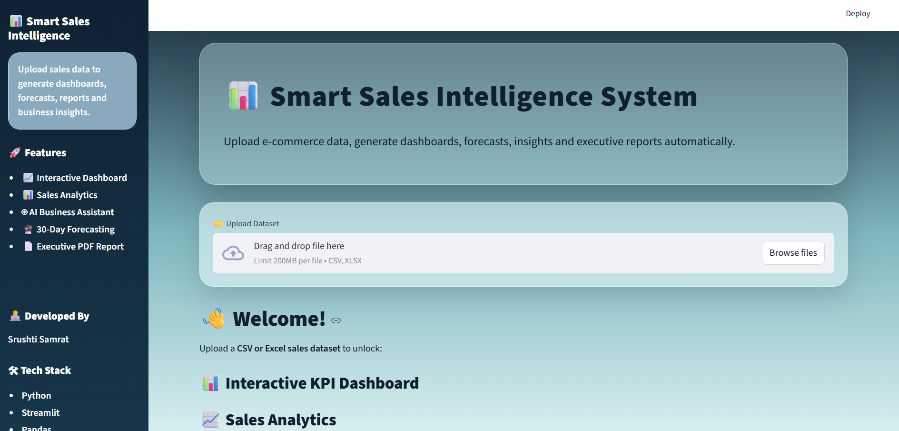
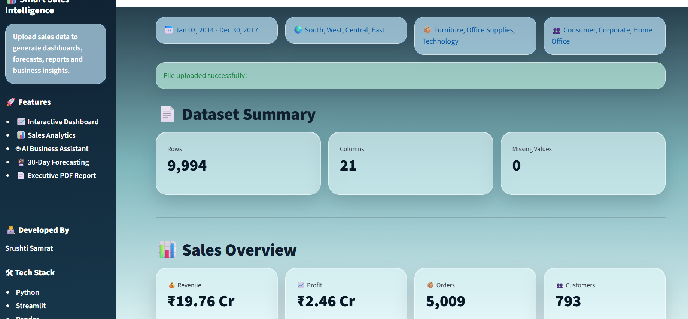
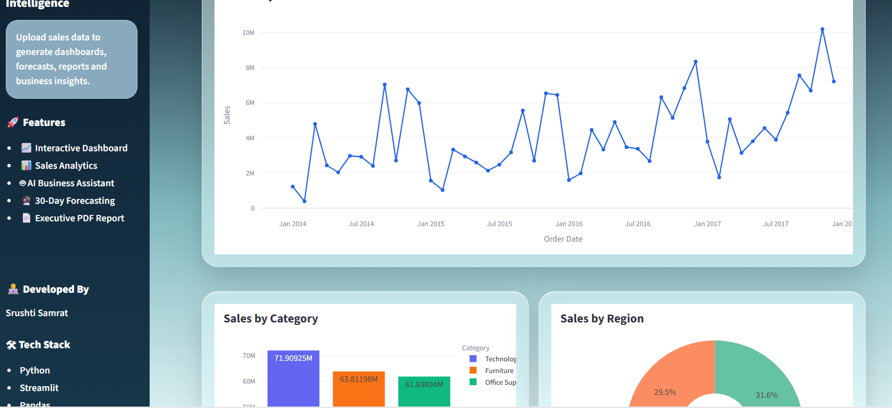
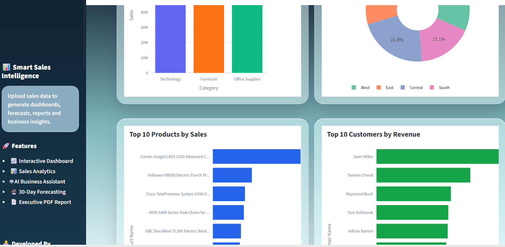
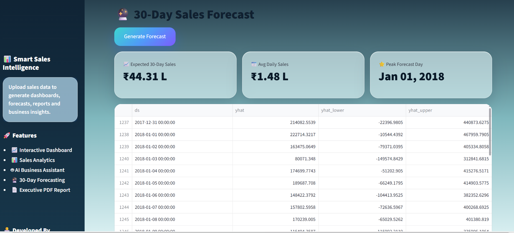
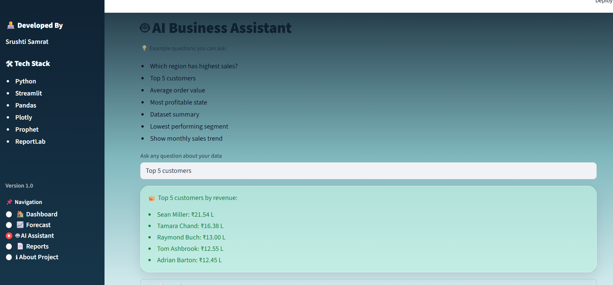
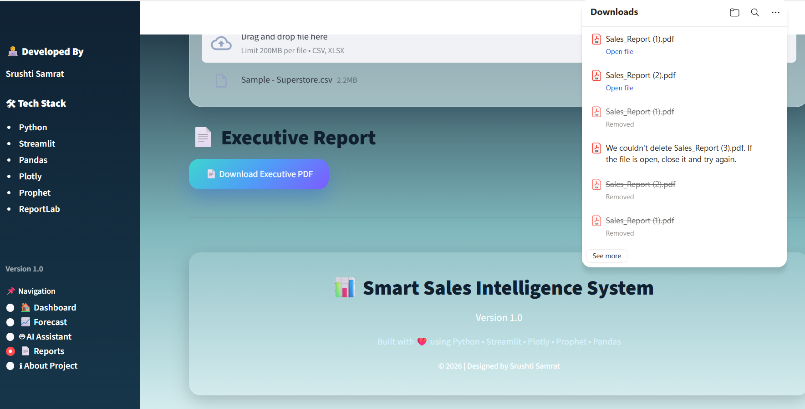
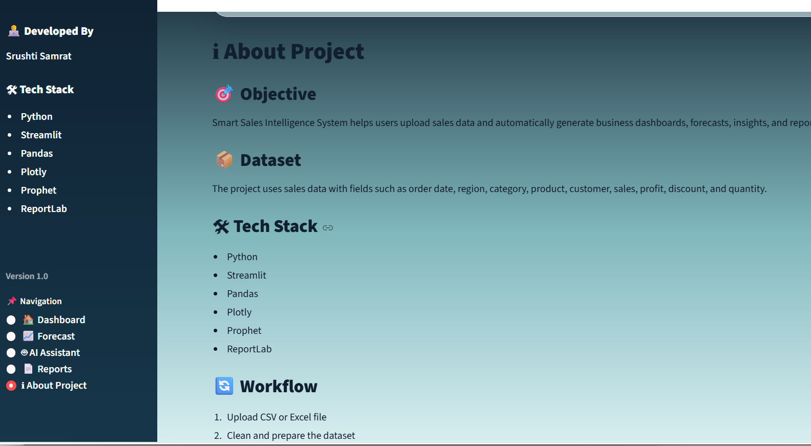

# 📊 Smart Sales Intelligence System

A modern business intelligence web application built using Streamlit for analyzing sales datasets, forecasting future sales, generating executive reports, and answering business questions through an AI-powered assistant.

---

## 🚀 Features

- 🔐 Secure Login Screen
- 📊 Interactive KPI Dashboard
- 📈 Sales & Profit Analytics
- 🔮 30-Day Sales Forecast (Prophet)
- 🤖 AI Business Assistant
- 📄 Executive PDF Report Generator
- 🎯 Dynamic Filters
- 📥 Export Filtered Data
- 📱 Responsive Glassmorphism UI

---

## 🛠 Tech Stack

- Python
- Streamlit
- Pandas
- Plotly
- Prophet
- ReportLab
- Scikit-Learn

---

## 📸 Screenshots

---

## 🔐 Login

<p align="center">
  
  
</p>

---

## 📊 Dashboard

<p align="center">
  
  
</p>

<p align="center">
  
  
</p>

---

## 🔮 Sales Forecast

<p align="center">
  
</p>

---

## 🤖 AI Business Assistant

<p align="center">
  
</p>

---

## 📄 Executive Report

<p align="center">
  
</p>

---

## ℹ️ About Project

<p align="center">
  
</p>

## 📂 Project Structure

```
Smart-Sales-Intelligence
│
├── app.py
├── requirements.txt
├── README.md
├── assets/
├── utils/
├── reports/
├── screenshots/
└── pages/
```

---

## ⚙ Installation

```bash
git clone <repository-url>

cd Smart-Sales-Intelligence

pip install -r requirements.txt

streamlit run app.py
```

---

## 📊 Dataset

The application supports CSV and Excel sales datasets containing fields such as:

- Order Date
- Sales
- Profit
- Quantity
- Category
- Sub-Category
- Customer
- Region
- Segment
- State
- City

---

## ✨ Future Improvements

- Database Integration
- Role-Based Authentication
- Cloud Deployment
- Real AI using LLM APIs
- Multi-user Support

---

## 👩‍💻 Developer

**Srushti Samrat**